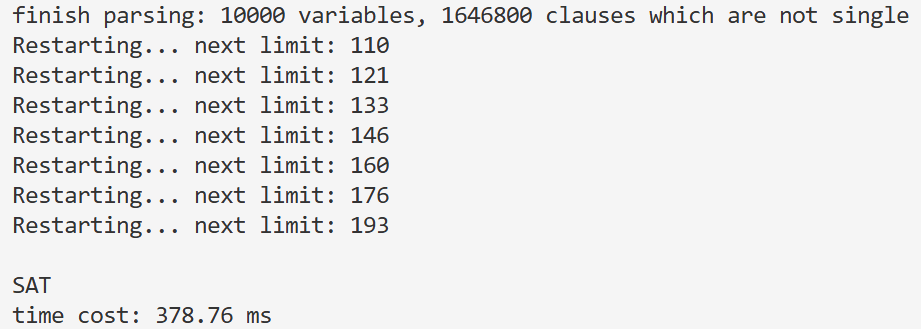
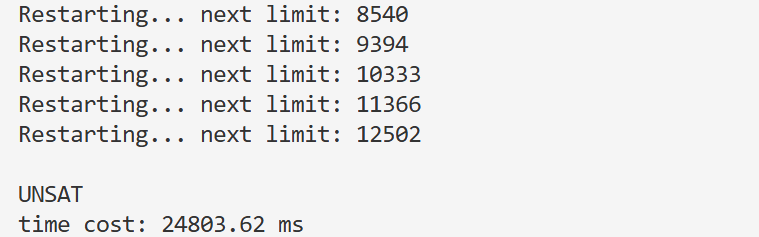

# CDCL-based SAT Solver

本项目是一个基于 C++ 实现的高性能 **SAT (Boolean Satisfiability Problem)** 求解器。该求解器核心采用了现代 SAT 求解的主流框架 —— **CDCL (Conflict-Driven Clause Learning)** 算法，并集成了多种工业级优化技术。

## 🚀 核心技术特性

本项目深入集成了以下提升求解效率的关键组件：

* **CDCL**：通过分析冲突产生的根源，学习并添加新的子句（Learnt Clauses），有效剪枝搜索空间。
* **1st UIP 分析**：在冲突分析过程中提取 1st UIP 节点，生成最具通用性的学习子句，加速回跳（Backjumping）。
* **Two-Watched Literals**：针对单位传播进行了内存与计算优化，仅监视子句中的两个文字，极大减少了变量赋值时的搜索开销。
* **VSIDS 启发式分支策略**：实现了类似 VSIDS 的Activity评分机制，优先决策参与冲突频繁的变量，并配合Decay机制动态调整搜索重心。
* **Restart**：引入了基于冲突次数的重启策略（带增长因子），有效防止求解器陷入局部搜索陷阱。
* **Phase Saving**：记录变量上次赋值的极性，在回跳或重启后保持搜索方向的连续性。

## 🏗️ 架构设计

项目采用面向对象的设计思想，代码结构清晰，易于扩展：

* **`SATtype.h` (核心数据结构)**：
    * `Lit` / `Var`：位运算优化的文字表示，支持快速取反与索引转换。
    * `Clause`：紧凑的子句存储结构，支持学习子句标记。
* **`Solver.cpp` (核心逻辑)**：
    * `propagate()`：双监视文字驱动的高效单位传播引擎。
    * `analyze()`：基于轨迹栈Trail和标记位Seen的冲突分析算法。
    * `solve()`：主控制循环，集成决策、传播、冲突分析与回退逻辑。

## 📊 性能表现

* **标准格式支持**：完美解析 DIMACS CNF 文件格式。
* **实际测试**：在 `100queens.cnf` 等经典测试集上，展示了毫秒级的快速收敛能力。
* **健壮性**：内置浮点数溢出保护，确保在大规模冲突分析下的数值稳定性。
## ✅ 测试结果展示

通过不同类型的逻辑问题测试，验证了 Solver 的求解性能与准确性。

| 测试项目 | 运行截图 | 核心指标说明 |
| :--- | :---: | :--- |
| **100 Queens** |  | **逻辑覆盖**：验证大规模 N 皇后问题的约束传播效率。 |
| **复杂 UNSAT** |  | **完备性检测**：通过遍历所有空间确保 Solver 无漏报。 |

> 
> **UNSAT 测试说明**：UNSAT 问题需要遍历所有可能路径，并且能检测 Solver 正确性，因此运行时间相对较长。

# 🛠 项目构建与运行指南

本工具集成了 **高性能 SAT 求解器** 与 **N 皇后问题 CNF 生成器**，旨在提供高效的逻辑约束求解方案。

---

### 1. 环境要求
确保您的开发环境已安装支持 **C++11** 或更高标准的编译器。

---

### 2. 编译步骤
使用 `-O3` 优化选项以获得最佳的运算性能：
* **编译 CNF 生成器** 用于自定义生成不同规模的 N 皇后问题：
    ```bash
    g++ -O3 makecnf.cpp -o makecnf
    ```
>如果不自定义测试cnf，也可以使用项目内置的两个cnf文件测试，在Solver.cpp的main函数中修改文件名即可。
* **编译主求解器** 用于处理 `.cnf` 文件并输出结果：
    ```bash
    g++ -O3 Solver.cpp -o sat_solver
    ```


---

### 3. 运行与测试

#### 📂 准备测试数据
项目中内置了两个典型的测试案例，您可以在 `main` 函数中修改文件名进行切换：
* `100queens.cnf`：规模较大的 SAT 问题示例。
* `testunsat.cnf`：用于验证求解器完备性的复杂 UNSAT 实例。

#### 🚀 执行求解
确保 `.cnf` 文件与程序在同一目录下，运行以下命令：
```bash
./sat_solver
```

## 📝 项目总结

开发高性能 SAT Solver 是一个具有挑战性的系统级编程实践。本项目并非简单的算法堆砌，而是一个高度精密、逻辑自洽的工程系统：

严密的函数协同与逻辑耦合：
从 parse_DIMACS 的高效数据读取，到 propagate 引擎与 watchers 监视列表的实时交互，每一个核心函数都通过严密的逻辑契合在一起。例如，analyze 冲突分析函数生成的学习子句，会直接反馈给 cancel 进行非时序回跳，并同步更新 activity 堆结构，这种函数间的高频、精准协作，体现了系统级编程对复杂逻辑流的掌控能力。